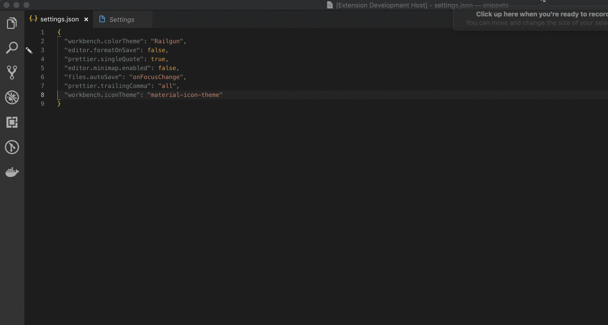

# ShiftThat for Visual Studio Code

 A Visual Studio Code extension that sorts your user or workspace settings. Ideal for those OCD people who like organized settings files.

## Install

1. Open **Extensions** sidebar panel in Visual Studio Code. `View → Extensions`
1. Search for `ShiftThat`
1. Click **Install**
1. Click **Reload**, if required

## Features

Commands can be found in the command palette. Look for commands beginning with `ShiftThat:`

- Sort User Settings Alphabetically
- Sort Workspace Settings Alphabetically

## Credits

- Logo made by <a href="https://www.freepik.com/" title="Freepik">Freepik</a> from <a href="https://www.flaticon.com/" title="Flaticon">www.flaticon.com</a> is licensed by <a href="http://creativecommons.org/licenses/by/3.0/" title="Creative Commons BY 3.0" target="_blank">CC 3.0 BY</a>